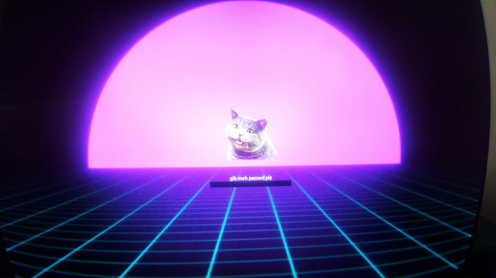

# Burgerwave 
## Plymouth Theme

Burgerwave is a plymouth theme for Linux systems (so far, I've only tested 
it on Debian-based systems, so I have not tried on Fedora/RedHat-based systems).

The theme is a simple merging of cheezburger cat with a vaporwave background
(will get a better image in the near future).

When ./setup.sh is run, the -logo and -text folders are moved into the 
plymouth themes directory and linked as the default plymouth theme. 

If you have cryptsetup installed, ./setup.sh will alter "Please unlock disk"
to a more cutesy "gib meh passwd plz". This is especially amusing if you have 
enabled full-disk encryption (FDE) on your system (the original use-case for
the theme).

If your attempt to sign in fails, he says "dis no gud", and if you login 
correctly, he says "o hai".

*spiffycell*
